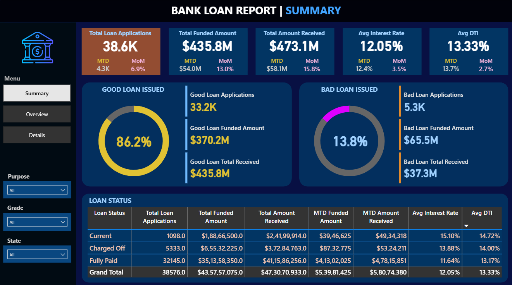

# Bank Loan Analysis Report

## Overview

This project provides a comprehensive analysis of a bank's loan portfolio, designed to uncover insights into lending performance, credit risk, and customer behavior. A full-scale business intelligence solution was developed, starting with data querying and validation in SQL and culminating in a multi-page, interactive dashboard built in Power BI.

## Business Problem

In the financial sector, effective risk management and portfolio monitoring are crucial for profitability and stability. This project addresses key business questions to support strategic decision-making:
- What is the overall health of the loan portfolio (total applications, funded amounts, interest rates)?
- How can we quantify the financial risk associated with "Good" vs. "Bad" loans?
- Are there seasonal trends or monthly patterns in lending activity?
- Which states or regions are the most significant markets?
- What are the primary purposes for loans, and how do they perform?
- How do borrower characteristics like employment length and home ownership correlate with lending metrics?

## Tools & Technologies

- **Database:** MS SQL Server
- **Business Intelligence:** Power BI
- **Languages:** SQL (T-SQL), DAX
- **Version Control:** GitHub

## Project Structure

                   

## Data Cleaning & Preparation

- **Database Connection:** Connected Power BI directly to the MS SQL Server database to ensure a single source of truth.
- **Data Validation:** Performed data quality checks in Power Query to validate data types and handle potential inconsistencies before analysis.
- **Data Modeling:**
    - Created a dedicated **Date Table** using DAX to support robust time intelligence calculations (MTD, MoM).
    - Established a relationship between the Date Table and the primary `bank_loan_data` table.
- **Feature Engineering:**
    - Grouped the `loan_status` column into 'Good Loan' (Current, Fully Paid) and 'Bad Loan' (Charged Off) categories to streamline risk analysis.

## Key Metrics & KPIs

The analysis focused on several key performance indicators to measure the portfolio's health:
- **Total Loan Applications:** 38.6K
- **Total Funded Amount:** $435.8M
- **Total Amount Received:** $473.1M
- **Average Interest Rate:** 12.05%
- **Average DTI (Debt-to-Income Ratio):** 13.33%

## Risk Analysis & Key Findings

1.  **Good vs. Bad Loan Segmentation:** The portfolio consists of **86.2% 'Good Loans'** and **13.8% 'Bad Loans'**. While the majority of loans are performing well, the 'Bad Loan' segment represents a significant risk.

2.  **Financial Impact of Bad Loans:** 'Bad Loans' account for **$65.5M** in funded capital but have only returned **$37.3M**, resulting in a substantial financial loss and highlighting the need for improved risk assessment.

3.  **Monthly Growth Trend:** The "Total Loan Applications by Month" chart reveals a consistent upward trend throughout the year, signaling positive business growth and increasing market demand.

4.  **Top Loan Purpose:** **'Debt Consolidation'** is the most frequent reason for loan applications, indicating a key customer need that the bank is serving.

5.  **Geographic Concentration:** The analysis identified **California (CA)** as the top state for both the number of loan applications and the total funded amount, marking it as a critical market.

## Performance Analysis

- **Time-Series Analysis:** The dashboard tracks Month-to-Date (MTD) and Month-over-Month (MoM) changes for all key metrics, allowing for real-time performance monitoring.
- **Loan Term Performance:** Loans with a **36-month term** are significantly more common than those with a 60-month term.
- **Borrower Profiles:**
    - Borrowers with **10+ years of employment** represent the largest group of applicants.
    - Borrowers who are **renting** or have a **mortgage** make up the vast majority of the portfolio.

## Dashboard

The Power BI solution consists of three interactive pages:
- **Summary:** A high-level KPI dashboard for an at-a-glance view of portfolio health.
- **Overview:** A deep-dive page with dynamic charts and cross-filtering capabilities for granular analysis.
- **Details:** A tabular view for examining individual loan records.

## How to Run This Project

1.  **Database Setup:**
    - Set up an MS SQL Server database.
    - Use a tool like SQL Server Management Studio (SSMS) to create a database and import the `data/bank_loan_data.csv` file into a table named `bank_loan_data`.

2.  **SQL Validation (Optional):**
    - Open `sql_queries/analysis_queries.sql` in SSMS.
    - Run the queries against your database to validate the metrics and understand the data structure.

3.  **View the Dashboard:**
    - Open `dashboard/bank_loan_report.pbix` in Power BI Desktop.
    - If prompted, update the data source credentials to connect to your local SQL Server instance.

## Final Recommendations for Future Analysis

- **Refine Risk Models:** Investigate the specific characteristics of 'Bad Loans' (e.g., grade, DTI, purpose) to build a more predictive risk assessment model.
- **Optimize Regional Strategies:** Analyze underperforming states to identify opportunities for growth or changes in lending strategy.
- **Customer Segmentation:** Create detailed customer segments based on financial behavior to develop targeted marketing campaigns and personalized loan products.

---

## Contact

**Ayush Butoliya** 
Email: ayushbutoliya22@gmail.com
